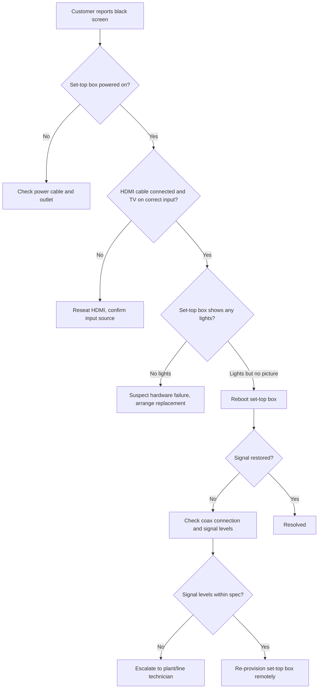
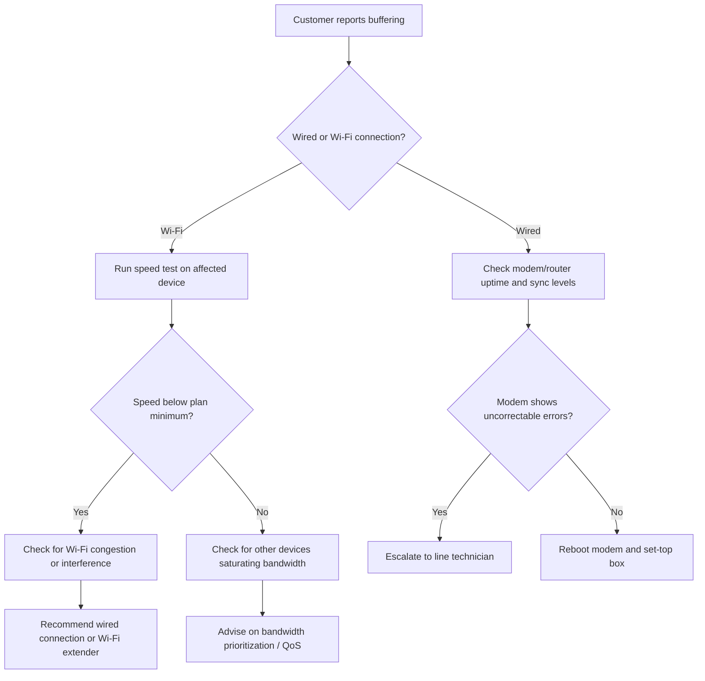
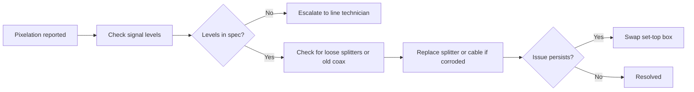
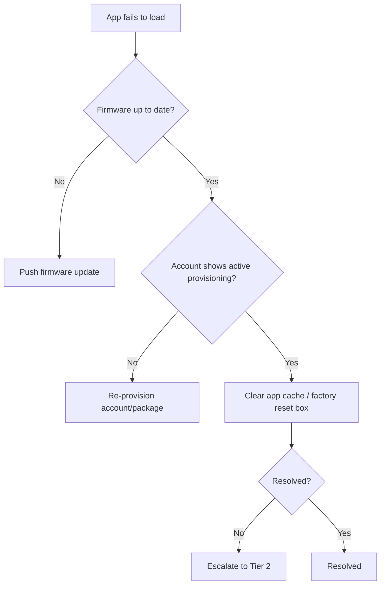

# IPTV troubleshooting guide

Reference guide for diagnosing common IPTV service issues reported by customers.

## Quick reference

| Symptom | Likely cause | Jump to |
|---|---|---|
| No picture / black screen | Signal, HDMI, or set-top box power | [No signal](#no-signal--black-screen) |
| Buffering / spinning wheel | Bandwidth or Wi-Fi congestion | [Buffering](#buffering--freezing) |
| Pixelation or blocky video | Signal strength or line noise | [Pixelation](#pixelation--picture-quality) |
| Audio out of sync | HDMI handshake or app cache | [Audio sync](#audio-out-of-sync) |
| App won't load / crashes | Firmware or account provisioning | [App issues](#app-wont-load-or-crashes) |

---

## No signal / black screen

Start with the physical layer before touching software.

**Steps:**
1. Confirm the set-top box has power (LED indicator lit).
2. Confirm HDMI is seated and the TV is on the correct input.
3. Power-cycle the set-top box (unplug 10 seconds, plug back in).
4. Check coax signal levels in the provisioning tool.
5. If levels are out of spec, escalate to a line technician rather than continuing software troubleshooting.

---

## Buffering / freezing

Almost always a bandwidth problem, not a set-top box problem.

**Steps:**
1. Ask whether the affected TV is wired or on Wi-Fi.
2. For Wi-Fi, run a speed test on a device near the affected TV.
3. Check the modem's sync levels and error counts for line issues.
4. Rule out other bandwidth-heavy devices on the network (streaming, gaming, downloads).
5. Reboot modem, then set-top box, in that order.

---

## Pixelation / picture quality

**Common causes:** corroded connectors, too many splitters between the tap and the box, damaged coax, or marginal signal levels that only show up under load.

---

## Audio out of sync

1. Power-cycle the set-top box first — this resolves most HDMI handshake issues.
2. If using a soundbar or AV receiver, check for an audio processing delay setting and adjust.
3. Confirm the TV isn't applying its own post-processing (motion smoothing / game mode can introduce lag).
4. If sync drifts progressively during playback (rather than a fixed offset), suspect a decoder issue on the set-top box — replace the unit.

---

## App won't load or crashes

**Steps:**
1. Confirm the set-top box firmware is current.
2. Confirm the customer's account and package are active and correctly provisioned.
3. Clear the app's cache, or perform a factory reset as a last resort before escalating.
4. Escalate to Tier 2 if the issue persists after a reset — this usually indicates a server-side or licensing problem outside the TSR's control.

---

## When to escalate

Escalate immediately, without further troubleshooting, if:
- Signal levels are out of spec at the tap (line issue, not customer premise)
- The set-top box shows no lights after a confirmed power source
- Multiple customers in the same service area report the same symptom (possible node-level outage)

*This is placeholder/sample content generated for portal testing purposes — replace with verified internal procedures before publishing.*
