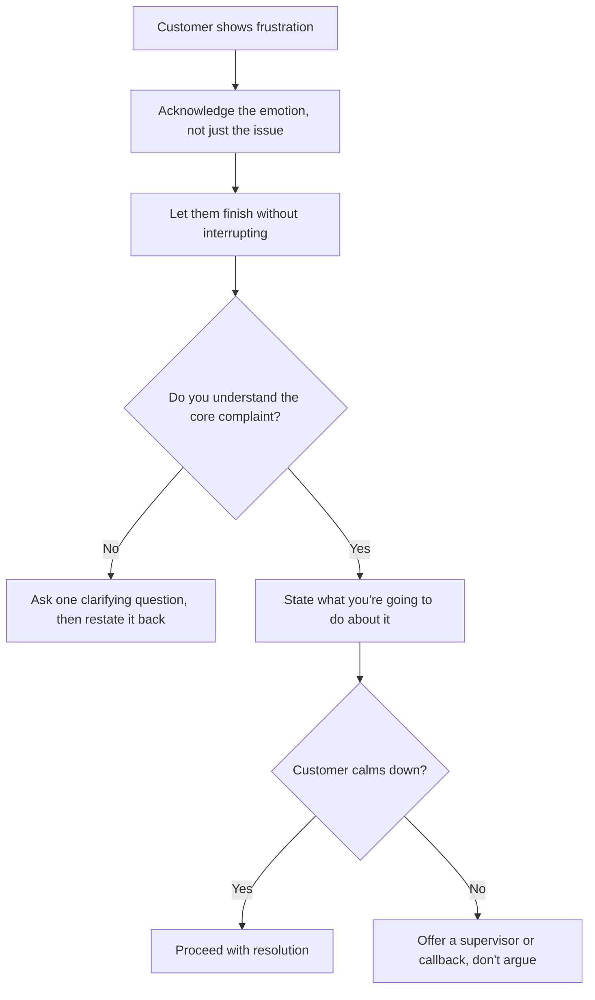

# Customer de-escalation

Guidance for handling frustrated or upset customers before a situation requires formal escalation.

## Recognize escalation triggers early

Common signs a call is heading toward frustration:
- Raised voice, interruptions, or talking over you
- Repeating the same complaint multiple times
- Mentioning prior calls that didn't resolve the issue
- Explicit statements like "this is ridiculous" or "I want to cancel"

Catching these early makes de-escalation far easier than waiting until the customer is already angry.

## Core approach

## What to say

- **Acknowledge before problem-solving.** "I hear you — you've called about this twice now and it's still not fixed. That's frustrating, and I want to get this actually resolved today."
- **Don't argue the facts mid-frustration.** Even if the customer is factually wrong about something, correct it gently after they've been heard, not while they're still venting.
- **Use their name and stay calm.** A steady, unhurried tone does more to de-escalate than any specific phrase.
- **Avoid corporate-sounding deflection.** Phrases like "I understand your frustration" said flatly can feel dismissive — pair it with something specific to their situation.

## What not to do

- Don't match their tone or raise your own voice.
- Don't say "calm down" — it almost never works and often escalates further.
- Don't make promises you can't keep just to end the call peacefully.
- Don't rush to transfer before attempting to resolve — an unnecessary transfer often re-triggers the frustration with the next person.

## When to involve a supervisor

Loop in a supervisor when:
- The customer explicitly requests one.
- The customer is threatening to cancel service and you've exhausted standard retention/resolution steps.
- The conversation includes abusive language directed at you personally (see below).
- You've offered a fair resolution twice and the customer rejects both, with no path forward.

## Handling abusive language

- You're not required to remain on a call where a customer is using abusive, threatening, or discriminatory language toward you.
- Give one clear, calm warning: "I want to help you, but I need us to keep this respectful. If that continues, I'll need to end the call."
- If it continues, disengage per your team's standard process and document the call accurately, including direct quotes where possible.

## After the call

- Log what triggered the frustration, not just the technical issue — this helps identify systemic problems (e.g. repeat callers on the same unresolved issue).
- If a supervisor was looped in, make sure the handoff notes are clear so the customer doesn't have to repeat their story from scratch.

---

*This is placeholder/sample content generated for portal testing purposes — replace with verified internal standards before publishing.*
